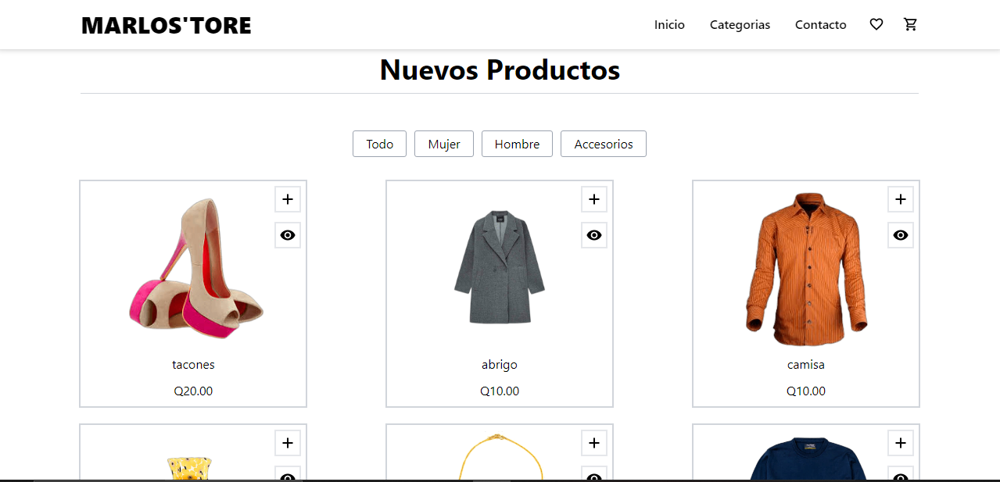

# e-commerce

## Acerca/Descripcion
Esta aplicación es una aplicación de comercio electrónico completamente funcional  y los usuarios pueden ver un solo producto, pasar al carrito, en el carrito puede elimninar un producto y finalizar la compra y démas funcionalidades

### Tecnología utilizada:
* HTML
* CSS -> TAILWIND
* JAVASCRIPT
* REACT
* REACT ICONS
* REDUX TOOLKIT

## NPM comandos
* `npm i`  Para instalar todas las dependencias 
* `npm run dev`  Para inicializar el servidor local
